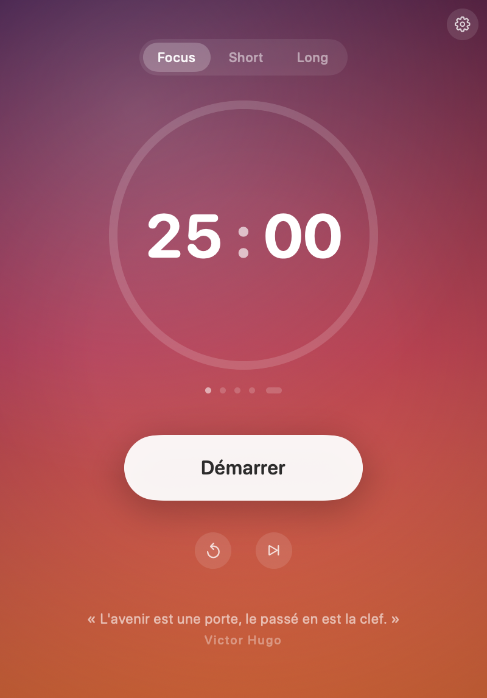

# Focus

Minuteur Pomodoro pour macOS. Le code est privé, ce dépôt ne porte que les binaires.

**[Télécharger Focus.dmg](https://github.com/jeremy-prt/focus-releases/releases/latest/download/Focus.dmg)** · [Page de téléchargement](https://jeremy-prt.github.io/focus-releases/)

## Installation

1. Ouvrir le `.dmg`, glisser **Focus** dans **Applications**.
2. Au premier lancement, macOS bloque l'app (signature ad-hoc, inconnue d'Apple) et
   propose de la mettre à la corbeille. Cliquer « Terminé », puis ouvrir **Réglages
   Système > Confidentialité et sécurité**, descendre tout en bas, cliquer
   **« Ouvrir quand même »** et confirmer. À faire une seule fois.

macOS 14 (Sonoma) minimum · Apple Silicon et Intel.

## L'app

- 25 min de focus, 5 de pause courte, 20 de pause longue toutes les 4 sessions —
  le cycle s'enchaîne tout seul, et tout est réglable.
- Compte à rebours dans l'encoche : replié il en épouse la largeur, au survol il
  s'ouvre sur lecture / recommencer / passer.
- Le dégradé de fond suit l'heure de la journée, et bascule sur une gamme froide
  pendant les pauses.
- Espace démarre et met en pause, ⌘R recommence, ⌘→ passe à la suite.
- Fermer la fenêtre laisse Focus dans la barre des menus.
